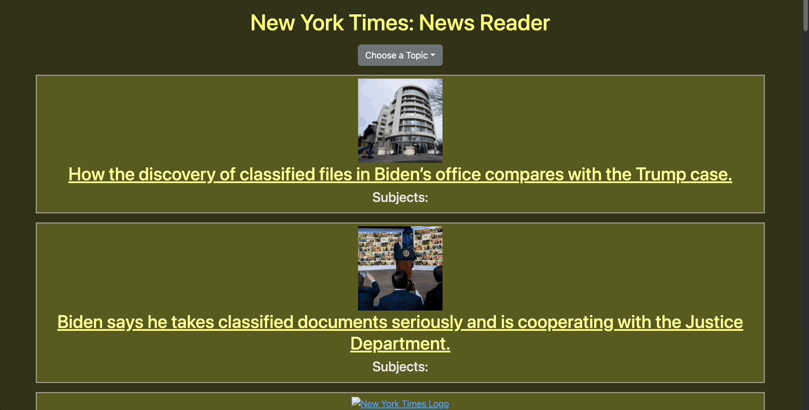
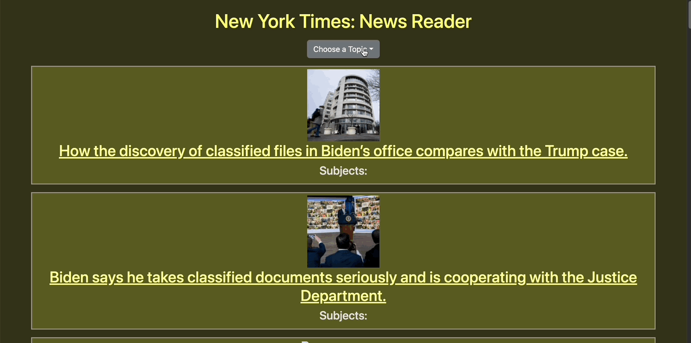
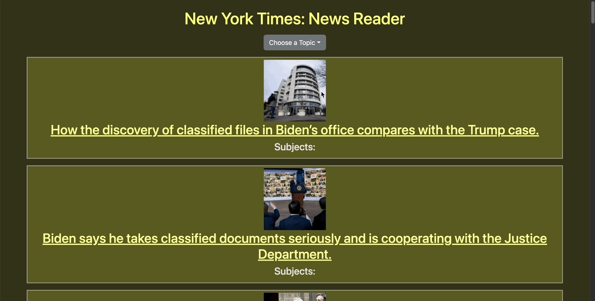
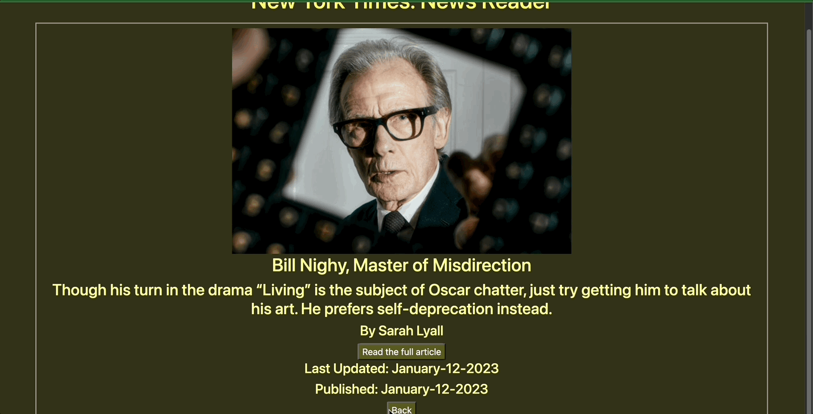
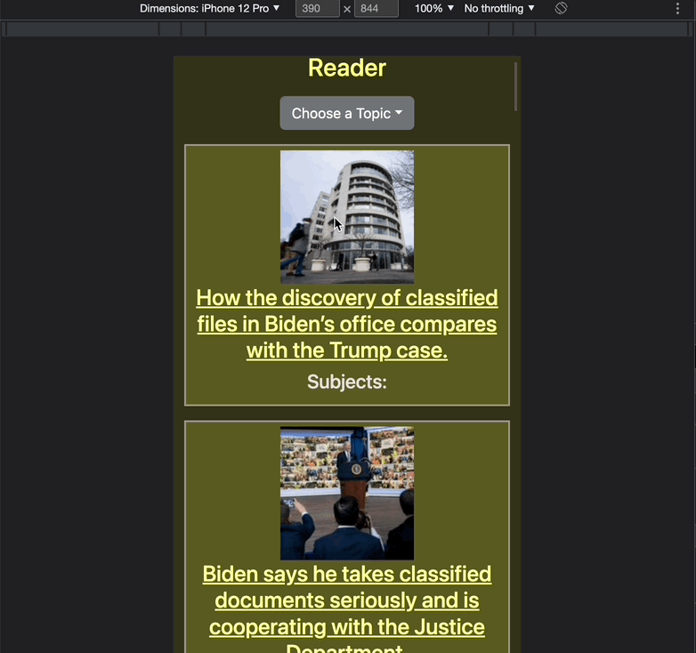

<a name="readme-top"></a>

# Welcome to New York Times: News Reader 👋

## Table of Contents

- [Introduction](#introduction)
- [Technologies](#technologies)
- [Deployed Link](#🏠-deployed-link)
- [Set-up and Useage](#set-up-and-usage)
- [Features](#features)
- [Future Features](#future-features)
- [Organization](#organization)
- [Author](#author)

## Introduction

> New York Times: News Reader displays top stories headlines from the New York Times and allows the user to search for stories by topics. Each headline can be clicked for a more detailed information on the story and a link to the article on the New York Times website.

## Technologies


### 🏠 [Deployed Link](https://ny-times-news-reader-2mkew09ee-universal-patois.vercel.app/)

## :wrench: Set-up and Usage

- To run this application locally

### Prerequisites

- npm

  ```sh
  npm install npm@latest -g
  ```

### Installation

1. Clone the repo

   ```sh
   git clone https://github.com/Universal-Patois/NYTimesNewsReader
   ```

2. Install NPM packages

   ```sh
   npm install
   ```

### Usage

```sh
npm start
```

### Run tests

```sh
npm cypress run
```

<p align="right">(<a href="#readme-top">back to top</a>)</p>

## Features

### Landing Page



### Selecting a Topic



### Getting Article Details



### Link to Article NY Times Website


### Back to Landing Page



### Responsive Layout



<p align="right">(<a href="#readme-top">back to top</a>)</p>

## Future Features

- Pagination of articles

## Organization

- Project Board: [Github Projects](https://github.com/users/Universal-Patois/projects/7)
- Wire Frame: [Miro](https://miro.com/app/board/uXjVPzssfjg=/)

## Author

👤 **Andrew Knapick**

- Github: [@Universal-Patois](https://github.com/Universal-Patois)
- LinkedIn: [@andrew-knapick](https://linkedin.com/in/andrew-knapick)

<p align="right">(<a href="#readme-top">back to top</a>)</p>
